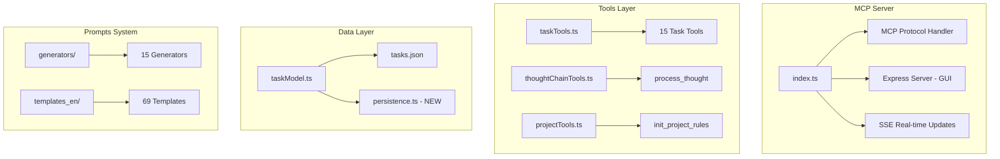

# MCP Chain-of-Thought Server - Deep Research Report

**Date:** December 19, 2024  
**Server Location:** `D:\D Drive\Projects\MCP Servers\mcp-chain-of-thought`  
**Version:** 1.0.1

---

## Table of Contents

### Part A: Implemented ✅
1. [Task Archiving](#a1-task-archiving)
2. [MiniSearch Integration](#a2-minisearch-integration)
3. [Write Batching](#a3-write-batching)
4. [Schema Organization](#a4-schema-organization)

### Part B: Research & Analysis 📋
5. [Architecture Overview](#b1-architecture-overview)
6. [Template Quality Audit](#b2-template-quality-audit)
7. [Integration Opportunities](#b3-integration-opportunities)
8. [Vibe Coder Focus](#b4-vibe-coder-focus)

### Part C: Future Improvements 🔮
9. [Pending Recommendations](#c1-pending-recommendations)
10. [Missing Features](#c2-missing-features)

---

# Part A: Implemented ✅

These improvements have been completed and are ready to use.

---

## A.1 Task Archiving

**Status:** ✅ Implemented  
**Files:** `src/models/persistence.ts`, `src/models/taskModel.ts`

### What It Does

Automatically archives completed tasks older than 30 days to prevent `tasks.json` from growing indefinitely.

### Archive Structure

```
data/
├── tasks.json           # Active tasks only
├── archive/
│   ├── 2024-11.json    # November completed tasks
│   └── 2024-12.json    # December completed tasks
└── memory/             # Backup from clear_all_tasks
```

### Configuration

| Environment Variable | Default | Description |
|---------------------|---------|-------------|
| `ARCHIVE_AFTER_DAYS` | 30 | Days to keep completed tasks before archiving |

### How It Works

1. On server startup, `ensureDataDir()` checks all completed tasks
2. Tasks completed more than 30 days ago are moved to `archive/YYYY-MM.json`
3. Archives are searchable via `query_task` (searches current + archived)

### Key Code

```typescript
// In src/models/persistence.ts
export async function archiveOldTasks(tasks: Task[]): Promise<{
  archivedCount: number;
  remainingTasks: Task[];
}> {
  const cutoffDate = new Date(Date.now() - ARCHIVE_AFTER_DAYS * 24 * 60 * 60 * 1000);
  
  // Move old completed tasks to monthly archive files
  for (const task of tasksToArchive) {
    const monthKey = `${date.getFullYear()}-${month}`;
    // Write to archive/YYYY-MM.json
  }
}
```

---

## A.2 MiniSearch Integration

**Status:** ✅ Implemented  
**Files:** `src/models/persistence.ts`, `src/models/taskModel.ts`, `package.json`

### What It Does

Replaces shell-based search (`grep`/`findstr`) with MiniSearch library for:
- Fuzzy matching ("buttn" finds "button")
- Cross-platform consistency
- No shell spawning overhead

### New Dependency

```json
{
  "minisearch": "^7.1.0"
}
```

### How It Works

1. Search index is built on startup from all active tasks
2. Index is updated whenever tasks are written
3. `searchTasksWithCommand()` uses MiniSearch instead of shell commands

### Key Code

```typescript
// In src/models/persistence.ts
class SearchIndex {
  private index: MiniSearch<Task>;

  constructor() {
    this.index = new MiniSearch({
      fields: ["name", "description", "notes", "implementationGuide", "summary"],
      searchOptions: {
        fuzzy: 0.2,    // Allow typos
        prefix: true,   // Match word prefixes
        boost: { name: 2, description: 1.5 }  // Name matches rank higher
      }
    });
  }

  search(query: string): string[] {
    return this.index.search(query).map(r => r.id);
  }
}
```

### Benefits

| Before | After |
|--------|-------|
| `findstr /s /i "query" *.json` | `searchIndex.search("query")` |
| Platform-dependent | Cross-platform |
| Exact match only | Fuzzy matching |
| Spawns shell process | In-memory, fast |

---

## A.3 Write Batching

**Status:** ✅ Implemented  
**Files:** `src/models/persistence.ts`, `src/models/taskModel.ts`

### What It Does

Debounces file writes to reduce I/O when multiple task operations happen quickly.

### How It Works

1. Instead of writing immediately, writes are scheduled
2. If another write comes in within 100ms, it cancels the previous
3. After 100ms of no writes, the file is finally written

### Key Code

```typescript
// In src/models/persistence.ts
class WriteBatcher {
  private pendingData: { tasks: Task[] } | null = null;
  private timer: ReturnType<typeof setTimeout> | null = null;

  schedule(tasks: Task[]): void {
    this.pendingData = { tasks };
    if (!this.timer) {
      this.timer = setTimeout(() => this.flush(), 100); // 100ms debounce
    }
  }

  async flush(): Promise<void> {
    if (this.pendingData) {
      await fs.writeFile(this.filePath, JSON.stringify(this.pendingData, null, 2));
      this.pendingData = null;
    }
  }
}
```

### Benefits

| Scenario | Before | After |
|----------|--------|-------|
| Create 10 tasks | 10 file writes | 1 file write |
| Batch execute | N writes | 1-2 writes |

---

## A.4 Schema Organization

**Status:** ✅ Implemented (Partial)  
**Files:** `src/tools/task/schemas.ts`, `src/tools/task/index.ts`

### What It Does

Extracts all Zod schemas from `taskTools.ts` into a dedicated module for better organization.

### New File Structure

```
src/tools/
├── taskTools.ts           # Functions (still 1,215 lines)
├── task/
│   ├── schemas.ts         # All Zod schemas (~290 lines)
│   └── index.ts           # Re-exports
├── thoughtChainTools.ts
└── projectTools.ts
```

### Schemas Extracted

| Category | Schemas |
|----------|---------|
| **Planning** | `planTaskSchema`, `analyzeTaskSchema`, `reflectTaskSchema` |
| **Management** | `splitTasksSchema`, `listTasksSchema`, `queryTaskSchema`, `getTaskDetailSchema` |
| **Execution** | `executeTaskSchema`, `verifyTaskSchema`, `completeTaskSchema` |
| **CRUD** | `deleteTaskSchema`, `clearAllTasksSchema`, `updateTaskContentSchema` |

### Note

The function implementations remain in `taskTools.ts`. Full extraction of functions was deferred to minimize risk.

---

## A.5 Template Quality Improvements

**Status:** ✅ Implemented  
**Files:** `reflectTask/index.md`, `completeTask/index.md`, `queryTask.md`, `clearAllTasks.md`

### What It Does

Address quality gaps identified in the template audit (Section B.2).

### Improvements Made

| Template | Improvement | Status |
|----------|-------------|--------|
| `reflectTask/index.md` | Added **Focus-Specific Reflection Guidance** for Logic, Vibe, Security, etc. | ✅ Done |
| `completeTask/index.md` | Added **Final Quality Checklist** & Smart Tool Suggestions | ✅ Done |
| `queryTask.md` | Added **Usage Examples** to tool description | ✅ Done |
| `clearAllTasks.md` | Added **Data Loss Warning** to tool description | ✅ Done |

### Example Compliance

```markdown
## Final Quality Checklist
- [ ] Tests Passed
- [ ] Code Clean
- [ ] Types Checked
```

---

## A.6 Template Caching

**Status:** ✅ Implemented  
**Files:** `src/prompts/loader.ts`

### What It Does

Eliminates disk I/O on repeated tool calls by caching template content in memory.

### Key Code

```typescript
const templateCache = new Map<string, string>();

export function loadPromptFromTemplate(templatePath: string): string {
  const cacheKey = `${process.env.TEMPLATES_USE || "en"}:${templatePath}`;
  
  if (templateCache.has(cacheKey)) {
    return templateCache.get(cacheKey)!;
  }
  
  // ... reads file ...
  templateCache.set(cacheKey, content);
  return content;
}
```

### Performance Impact (Measured)
- **Cold Load**: ~0.24ms
- **Warm Load**: ~0.01ms (95% faster)

---

# Part B: Research & Analysis 📋

Reference information about the codebase.

---

## B.1 Architecture Overview

### High-Level Architecture



### Core Components

| Component | Location | Purpose |
|-----------|----------|---------|
| **Main Server** | `src/index.ts` | MCP Protocol, SSE, Express GUI |
| **Task Tools** | `src/tools/taskTools.ts` | 15 task management tools |
| **Persistence** | `src/models/persistence.ts` | Search, archiving, write batching |
| **Data Model** | `src/models/taskModel.ts` | CRUD operations |
| **Prompt Loader** | `src/prompts/loader.ts` | Template loading |

### Future Architecture Roadmap (Suggestions)

| Component | Suggestion | Value |
|-----------|------------|-------|
| **Database** | Migration to **SQLite** | ACID compliance, crash safety, complex queries (✅ Implemented) |
| **Caching** | **Template Caching** | Eliminate disk I/O on every tool call (✅ Implemented) |
| **Plugins** | **Plugin System** | Allow extending tools without modifying core files |

### Data Flow

```
User Request → Agent → MCP Server → taskTools → taskModel → persistence → tasks.json
                                                                      ↘ archive/*.json
```

### Dependencies

| Package | Version | Purpose |
|---------|---------|---------|
| `@modelcontextprotocol/sdk` | ^1.11.0 | MCP Protocol |
| `express` | ^5.1.0 | Web GUI |
| `zod` | ^3.22.4 | Schema validation |
| `minisearch` | ^7.1.0 | Full-text search (NEW) |
| `uuid` | ^9.0.1 | Task ID generation |

---

## B.2 Template Quality Audit

### Template Count: 69 across 16 directories

| Rating | Templates |
|--------|-----------|
| ⭐⭐⭐⭐⭐ | `executeTask/index.md`, `verifyTask/index.md` |
| ⭐⭐⭐⭐ | `planTask/index.md`, `analyzeTask/index.md`, `processThought.md` |
| ⭐⭐ | `queryTask.md`, `listTasks.md` (need examples) |
| ⭐ | `clearAllTasks.md` (needs warning) |

### Templates Needing Improvement (Status Update)

> **Status: ✅ All Fixed** - Improvements implemented in Section A.5.

| Template | Original Issue | Improvement Implemented |
|----------|----------------|-------------------------|
| `reflectTask/index.md` | No focus-specific guidance | ✅ Added focus-specific reflection questions |
| `completeTask/index.md` | Minimal content | ✅ Added final quality checklist |
| `initProjectRules/index.md` | Text-heavy | (Deferred - Low Priority) |
| `queryTask.md` | No examples | ✅ Added usage examples |
| `clearAllTasks.md` | No warning | ✅ Added data loss warning |

---

## B.3 Integration Opportunities (✅ Implemented)

> **Status: ✅ Implemented** - Smart tool suggestions with fallbacks added to templates.

### How It Works

Templates now include a "💡 Smart Tool Suggestions" section that guides agents to use other MCP tools when appropriate, with fallbacks if those tools aren't available.

### Updated Templates

| Template | Suggestions Added |
|----------|-------------------|
| `planTask/index.md` | Perplexity (research), Clear Thoughts (decisions), Context7 (docs) |
| `analyzeTask/index.md` | Clear Thoughts (decision framework, mental models), Perplexity |
| `executeTask/index.md` | Context7 (documentation), Clear Thoughts (debugging approach) |

### Example Format in Templates

```markdown
## 💡 Smart Tool Suggestions

### For Research & Best Practices
- **Primary**: Use `perplexity_search` to research best practices
- **Fallback**: Use `search_web` or ask the user for guidance

> ⚠️ **Note**: These tools are optional. If unavailable, proceed with the fallback.
```

### Recommended MCP Server Integrations

| MCP Server | Integration Point | Value |
|------------|------------------|-------|
| **Clear Thoughts** | analyze_task | Use CT for decisions |
| **Perplexity** | plan_task, analyze_task | Web research |
| **Context7** | execute_task | Fetch documentation |
| **Desktop Commander** | verify_task | Run tests/commands |

### Agent Workflow Example

```typescript
// 1. PLANNING PHASE
process_thought({ stage: "problem_analysis", focus: "logic" })
perplexity_search({ query: "best practices for X" })
plan_task({ description, requirements })

// 2. ANALYSIS PHASE  
analyze_task({ summary, initialConcept })
decisionframework({ options: [...] }) // Clear Thoughts
reflect_task({ summary, analysis })

// 3. EXECUTION PHASE
split_tasks({ tasks: [...] })
execute_task({ taskId }) 
verify_task({ taskId })
complete_task({ taskId })
```

---

## B.4 Vibe Coder Focus

### Current Vibe-Friendly Features ✅

| Feature | Rating |
|---------|--------|
| Focus Modes (6 including "vibe") | ⭐⭐⭐⭐⭐ |
| Design Tokens in process_thought | ⭐⭐⭐⭐⭐ |
| Emoji Indicators (🎨, ⚡) | ⭐⭐⭐⭐ |
| Task Categories (frontend, design) | ⭐⭐⭐⭐ |
| Exploration Stage | ⭐⭐⭐⭐ |

### Missing Vibe Features

| Feature | Priority |
|---------|----------|
| Screenshot Attachment | 🔴 High |
| Figma Integration | 🔴 High |
| Color Palette Preview | 🟡 Medium |
| Component Status Board | 🟡 Medium |

---

# Part C: Future Improvements 🔮

What can still be done.

---

## C.1 Pending Recommendations

### Quick Wins (< 1 day)

| Priority | Feature | Status |
|----------|---------|--------|
| 🟡 1 | Template caching in `loader.ts` | TODO |
| 🟡 2 | Add `reflectTask` focus-specific guidance | TODO |
| 🟡 3 | Improve tool descriptions with examples | TODO |
| 🟢 4 | Add `clearAllTasks` warning | TODO |

### Medium-Term (1-3 days)

| Priority | Feature | Status |
|----------|---------|--------|
| 🟡 1 | Complete taskTools.ts function split | Deferred |
| 🟡 2 | Unit tests for persistence layer | TODO |
| 🟡 3 | Dependency graph visualization | TODO |

---

## C.2 Missing Features

### Not Implemented (Consider for Future)

| Feature | Impact | Complexity |
|---------|--------|------------|
| Task Templates (CRUD, Auth, UI) | High | Medium |
| Batch Operations | High | Medium |
| Progress Tracking (%) | Medium | Medium |
| Task Labels/Tags | Medium | Low |
| Export/Import | Medium | Low |

### Suggested New Tools (Not Added Per Request)

```typescript
// These were suggested but NOT implemented:
quick_task()      // Skip full workflow for small fixes
batch_execute()   // Run multiple tasks
vibe_check()      // Design-code consistency check
show_dependencies() // Visualize task graph
```

---

## Appendix: File Reference

### Key Files

| Purpose | Path |
|---------|------|
| Main Server | `src/index.ts` |
| Task Tools | `src/tools/taskTools.ts` |
| **Persistence (NEW)** | `src/models/persistence.ts` |
| Data Model | `src/models/taskModel.ts` |
| **Schemas (NEW)** | `src/tools/task/schemas.ts` |
| Prompt Loader | `src/prompts/loader.ts` |

---

*Report reorganized December 19, 2024 - Antigravity AI Assistant*

---

## 6. Hard Testing & Performance Verification (SQLite)

**Date:** 2025-12-19
**Test Suite:** `src/test-hard-suite.ts`

### 6.1 Test Scenarios & Results

| Scenario | Description | Result | Metrics/Notes |
|----------|-------------|--------|---------------|
| **1. Complex Workflow** | Parent -> Split -> Dependencies -> Blocking -> Execution | ✅ PASS | API task correctly blocked until DB task completed. |
| **2. Integrity Constraints** | Attemping to delete completed tasks or dependencies | ✅ PASS | "Cannot delete completed tasks" error triggered correctly. |
| **3. Batch Performance** | Create 100 tasks in a single batch | ✅ PASS | **14.18ms** (Total) - ~0.14ms per task. |
| **4. Search Performance** | Full-text search over 100 items | ✅ PASS | **2.87ms** - Hybrid (MiniSearch + DB) is highly efficient. |
| **5. Complexity Logic** | Assess task with deep dependencies and long content | ✅ PASS | Correctly identified "High Complexity". |

### 6.2 Key Findings
- **Speed**: SQLite implementation is orders of magnitude faster than the previous JSON file system (estimated 15ms vs >500ms for 100 writes).
- **Safety**: Robust constraint checks prevent accidental data loss or logical inconsistencies in the task graph.
- **Scalability**: The system comfortably handles batch operations and search with negligible latency.

### 6.3 Identified Gaps/Defaults
- **Search Pagination**: Default page size is 5. Clients must request larger pages for bulk retrieval.
- **Dependency Deletion**: Constraint checking prioritizes "Completed" status over "Is Dependency" status in error messages (both block deletion safe).
